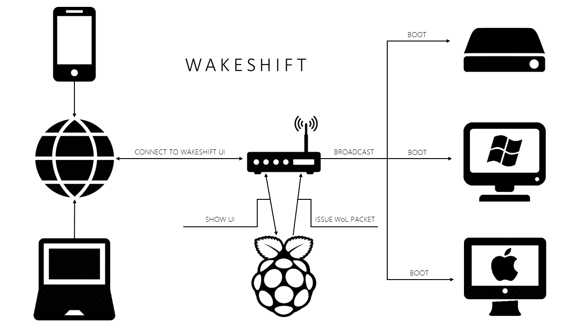

# wakeshift

What It Is
------
A Node.js web service application that scans specified IP Address ranges and issues Wake-on-LAN packets for selected MAC Addresses.

How to Use
------
Must be installed on a device connected to the target network. Great for an always-on, low-power node like the Raspberry Pi.

It would be a good idea to run Wakeshift as a persistent service with a `cron` job or as a Windows service.

Compatibility
------
Tested and working on Windows 10 and Debian Linux systems.

Prerequisites
------
Requires `nmap v6+` and `nbtscan` (Linux) or `nbtstat` (Windows) to be installed on the Wakeshift server.

**There is an `npm` install script that will automatically install the required packages (must be elevated user).**
`user@host ~/wakeshift $ sudo npm install`

Node Modules Used
------
- `Express   4.13.4`
- `Socket.io 1.4.5`
- `wake_on_lan 0.0.4`